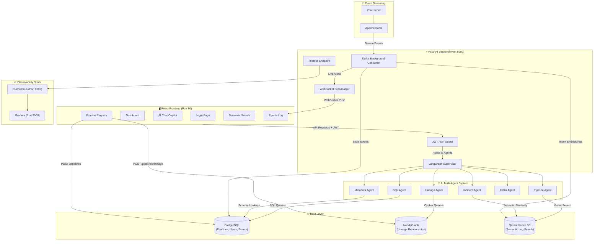
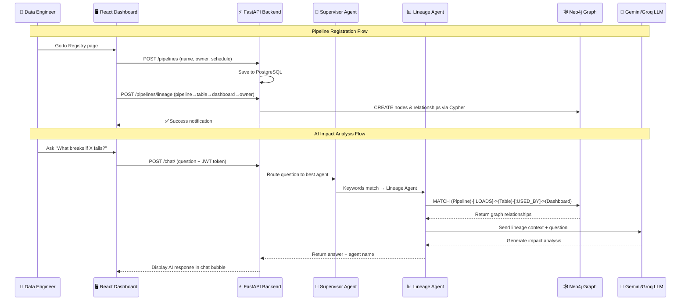
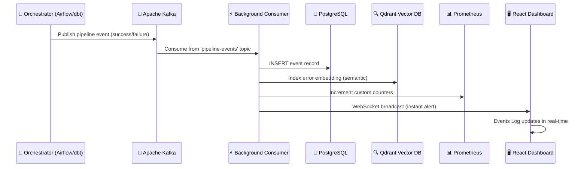
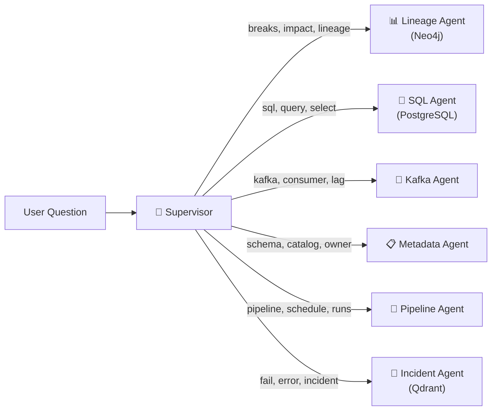
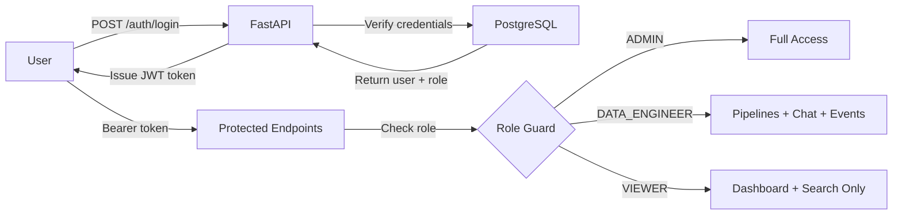

# DataOpsGPT 🚀

**An enterprise-grade, AI-powered Data Operations Copilot & Lineage Analyzer** — built to monitor, debug, and manage modern data platform pipelines from a single intelligent dashboard.

---

## 📐 System Architecture



---

## 🔄 Data Flow Architecture



---

## 🔄 Real-Time Event Streaming Flow



---

## 🛠️ Technology Stack

| Layer | Technology | Purpose |
|:------|:-----------|:--------|
| **Frontend** | React, Material UI, Vite, Axios | Glassmorphic dashboard with real-time WebSocket updates |
| **Backend** | FastAPI, SQLAlchemy, Uvicorn | REST API gateway with async background tasks |
| **AI Orchestration** | LangGraph, LangChain | Multi-agent supervisor routing to specialized agents |
| **LLM Providers** | Groq (primary) → Gemini (fallback) | Intelligent text generation with automatic failover |
| **Relational DB** | PostgreSQL | Pipeline metadata, user accounts, event logs |
| **Graph DB** | Neo4j | Data lineage relationships & dependency mapping |
| **Vector DB** | Qdrant + Sentence Transformers | Semantic similarity search over pipeline error logs |
| **Streaming** | Apache Kafka + ZooKeeper | Real-time pipeline event ingestion |
| **Auth** | JWT + Bcrypt | Token-based authentication with role-based access |
| **Observability** | Prometheus + Grafana | HTTP metrics, custom business counters, dashboards |
| **CI/CD** | GitHub Actions, Docker, Docker Compose | Automated testing, linting, and containerized deployment |

---

## ⚙️ Quickstart Setup

### Prerequisites
- Docker & Docker Compose
- Python 3.12+ (if running backend outside Docker)
- Node.js 20+ (if running frontend outside Docker)

### 1. Clone & Start Everything
```bash
git clone https://github.com/your-username/DataOpsGPT.git
cd DataOpsGPT
docker compose up --build -d
```

This single command launches all **9 services**: Frontend, Backend, PostgreSQL, Kafka, ZooKeeper, Neo4j, Qdrant, Prometheus, and Grafana.

### 2. Open the Dashboard
Navigate to `http://localhost` in your browser.

### 3. Log In
The system auto-seeds these demo accounts (password: `password` for all):

| Role | Email | Access Level |
|:-----|:------|:-------------|
| **Admin** | `admin@test.com` | Full access to all features |
| **Data Engineer** | `engineer@test.com` | Pipelines, Chat, Events, Registry |
| **Viewer** | `viewer@test.com` | Dashboard & Search only |

---

## 🌍 Services & Ports

| Service | URL | Credentials | Description |
|:--------|:----|:------------|:------------|
| **React Dashboard** | `http://localhost` | See above | Main user interface |
| **FastAPI Backend** | `http://localhost:8000` | — | REST API + Swagger docs at `/docs` |
| **Grafana** | `http://localhost:3000` | `admin` / `admin` | Metrics dashboards & alerting |
| **Neo4j Browser** | `http://localhost:7474` | `neo4j` / `password` | Visual graph explorer |
| **Prometheus** | `http://localhost:9090` | — | Metrics query engine |
| **Qdrant Console** | `http://localhost:6333` | — | Vector DB admin UI |

---

## 📖 User Guide

### Dashboard (`/`)

Your **command center** showing at a glance:
- **Kafka Cluster Status** — Live streaming connection health
- **Total Pipelines** — Count of registered workflows
- **Failed Runs** — Pipelines requiring immediate attention
- **Pipeline Events** — Total system log entries
- **Pipeline Cards** — Grid of all active pipelines with name, owner, schedule, and status

---

### Registry (`/registry`)

**Self-service pipeline management** — no terminal or API calls needed.

#### Register a Pipeline
Fill in the left form:
- **Pipeline Name**: e.g. `customer_etl_pipeline`
- **Team / Owner**: e.g. `Data Platform Team`
- **Cron Schedule**: e.g. `0 6 * * *` (daily at 6 AM)
- **Status**: `ACTIVE` or `INACTIVE`

Click **Register Pipeline** → Saves to PostgreSQL → Appears on Dashboard.

#### Map Data Lineage
Fill in the right form to define the downstream dependency chain:
- **Pipeline Name**: `customer_etl_pipeline`
- **Downstream Table**: `customer_clean` (the table this pipeline loads)
- **Affected Dashboard**: `Customer Analytics Dashboard` (what uses the table)
- **Owner**: `Marketing Team` (who gets impacted)

Click **Link Downstream Lineage** → Saves to Neo4j Graph → AI Copilot now understands the full data flow.

---

### AI Chat (`/chat`)

**Your intelligent DataOps assistant.** Ask questions in natural language:

| Question Type | Example | Agent Used |
|:--------------|:--------|:-----------|
| **Impact Analysis** | *"What breaks if customer_etl_pipeline fails?"* | Lineage Agent → Neo4j |
| **SQL Generation** | *"Generate SQL to find failed runs"* | SQL Agent → PostgreSQL |
| **Incident Diagnosis** | *"Why did the pipeline fail?"* | Incident Agent → Qdrant |
| **Kafka Monitoring** | *"What is the consumer lag?"* | Kafka Agent |
| **Metadata Lookup** | *"Who owns the customer_clean table?"* | Metadata Agent → PostgreSQL |
| **Pipeline Info** | *"Show all pipeline schedules"* | Pipeline Agent → PostgreSQL |

The **Supervisor Agent** automatically routes your question to the best specialist based on keyword analysis.

---

### Semantic Search (`/search`)

**AI-powered search** using sentence embeddings and Qdrant vector similarity. Type natural language queries like:
- *"customer pipeline timeout errors"*
- *"database connection failures"*

Finds semantically similar past incidents even when exact words don't match.

---

### Events Log (`/events`)

**Real-time streaming event feed** powered by Kafka + WebSockets:
- Pipeline run successes and failures appear **instantly** — no page refresh
- Severity levels: `INFO`, `WARNING`, `CRITICAL`
- Full timestamps and error messages

---

## 🔄 Typical Workflow

```
┌─────────────────────────────────────────────────────────┐
│  SETUP (One-time)                                       │
│  1. Go to Registry → Register your pipelines            │
│  2. Link lineage: pipeline → table → dashboard → owner  │
└─────────────────────────────────────────────────────────┘
                            │
                            ▼
┌─────────────────────────────────────────────────────────┐
│  DAILY MONITORING                                       │
│  3. Open Dashboard → Check pipeline health              │
│  4. Events Log auto-updates via WebSocket               │
│  5. Grafana shows request rates & failure counters      │
└─────────────────────────────────────────────────────────┘
                            │
                            ▼
┌─────────────────────────────────────────────────────────┐
│  INCIDENT RESPONSE                                      │
│  6. AI Chat: "What breaks if X fails?"                  │
│     → Lineage Agent traces full downstream impact       │
│  7. AI Chat: "Generate SQL to find failed runs"         │
│     → SQL Agent writes the query                        │
│  8. Search: "timeout errors" → finds similar past bugs  │
└─────────────────────────────────────────────────────────┘
                            │
                            ▼
┌─────────────────────────────────────────────────────────┐
│  RESOLUTION                                             │
│  9. Fix root cause in orchestrator (Airflow/dbt)        │
│  10. Re-run pipeline → Dashboard updates automatically  │
└─────────────────────────────────────────────────────────┘
```

---

## 🤖 Multi-Agent AI System

The AI Copilot uses a **LangGraph Supervisor** pattern to route queries:



**LLM Fallback Strategy**: Groq (primary, fast) → Gemini (fallback, reliable). If Groq fails, the system automatically retries with Gemini — zero downtime.

---

## 🔐 Authentication & RBAC

JWT-based authentication with role-based access control:



---

## 📊 Observability & Metrics

### Built-in Prometheus Counters
| Metric | Description |
|:-------|:------------|
| `http_requests_total` | Total HTTP requests by method and path |
| `http_request_duration_seconds` | Request latency histogram |
| `kafka_messages_consumed_total` | Kafka messages processed |
| `pipeline_events_processed_total` | Pipeline events ingested |
| `pipeline_failures_total` | Pipeline failure count |

### Grafana Dashboard Setup
1. Open `http://localhost:3000` (login: `admin` / `admin`)
2. Add Data Source → Prometheus → URL: `http://prometheus:9090`
3. Create panels using the metrics above

---

## 🧪 Running Tests

```bash
cd backend
python -m unittest discover -s tests
```

Runs 10 tests covering:
- JWT token creation & expiration
- Login with invalid credentials
- Protected endpoint access without token
- LLM fallback pipeline (Groq → Gemini)
- API endpoint routing & security

---

## 🚀 Production Deployment

| Component | Recommended Service |
|:----------|:-------------------|
| Frontend | Vercel / Netlify |
| Backend | Render / Railway / AWS EC2 |
| PostgreSQL | Supabase / AWS RDS |
| Neo4j | AuraDB (Neo4j Cloud) |
| Qdrant | Qdrant Cloud |
| Kafka | Confluent Cloud |

---

## 📁 Project Structure

```
DataOpsGPT/
├── backend/
│   ├── app/
│   │   ├── agents/          # LangGraph multi-agent system
│   │   ├── auth/            # JWT authentication & RBAC
│   │   ├── chat/            # AI Copilot chat endpoint
│   │   ├── core/            # Settings, LLM factory
│   │   ├── database/        # Neo4j connection
│   │   ├── db/              # PostgreSQL models & sessions
│   │   ├── kafka/           # Consumer, producer, config
│   │   ├── pipelines/       # Pipeline CRUD + lineage API
│   │   ├── search/          # Qdrant semantic search
│   │   ├── services/        # Lineage service, dashboard
│   │   └── main.py          # FastAPI app entry point
│   ├── tests/               # Unit & integration tests
│   ├── Dockerfile
│   └── requirements.txt
├── frontend/
│   ├── src/
│   │   ├── components/      # Sidebar, Navbar, ChatBox, PipelineCard
│   │   ├── pages/           # Dashboard, Chat, Search, Events, Registry, Login
│   │   └── services/        # API client, auth interceptors
│   ├── Dockerfile
│   └── package.json
├── docker-compose.yml        # Full 9-service orchestration
├── prometheus.yml            # Scrape configuration
└── .github/workflows/ci.yml # CI pipeline
```

---

## 📄 License

MIT License. Built for learning, portfolio demonstration, and enterprise DataOps innovation.